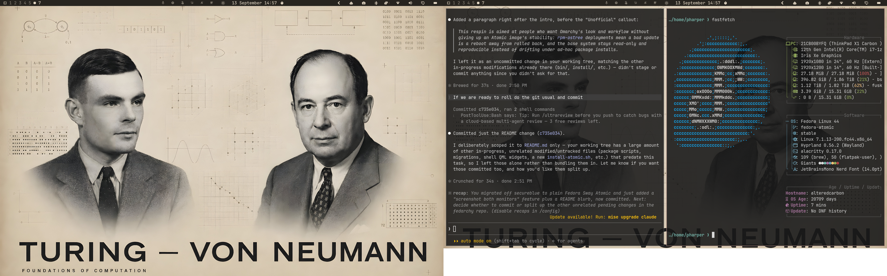
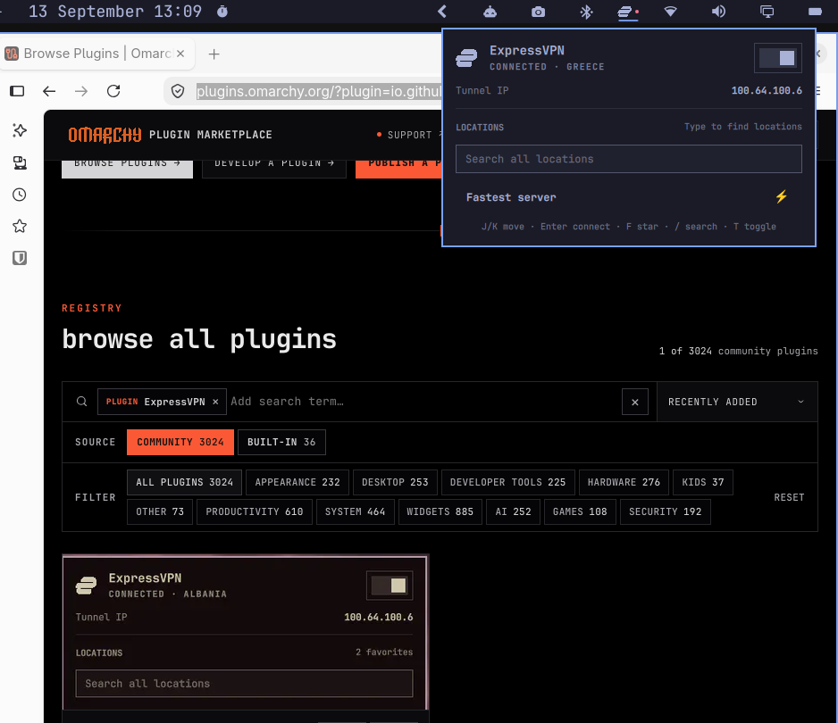

# Fedora Omarchy Atomic Respin

Omarchy (DHH's Hyprland desktop) ported to Fedora. Started from plain **Fedora Sway Atomic** and
built out from there, so that's the best-exercised target — but it's all standard `rpm-ostree`
underneath, so it should work the same way on any Fedora Atomic spin (Silverblue, Kinoite) or
Universal Blue image, **secureblue** included. secureblue's hardening removes `sudo` in favor of
`run0` and shadows the host `dnf`, so it needs a handful of extra steps beyond the base install —
see below.

This respin is aimed at people who want Omarchy's look and workflow without giving up an Atomic
image's stability: `rpm-ostree` deployments mean a bad update is a reboot away from rolled back,
and the base system stays read-only and reproducible instead of drifting under ad-hoc package
installs.



> ### ⚠️ Unofficial
> This is an unofficial, community-maintained fork. It is not affiliated with, endorsed by, or
> supported by DHH, the Omarchy project, Fedora, secureblue, or Universal Blue. It touches
> privilege escalation, package management, and your desktop session on an immutable OS — read
> before you run it, and if it breaks your system, you keep both pieces.

> ### 🆕 This is Omarchy "Quattro"
> This branch tracks **Omarchy quattro** — a major rework of the desktop. The bar, launcher,
> notifications, and OSD (waybar / walker / mako / swayosd) are replaced by a single **Quickshell**
> shell, and all Hyprland config — including every keybinding — moves to **Lua** (`.conf` → `.lua`).
> **→ See [QUATTRO-CHANGES.md](QUATTRO-CHANGES.md) for the full list of what changed.**

_This project is an extension of [Omarchy Mac](https://github.com/malik-na/omarchy-mac) project._


[](LICENSE) [](https://github.com/malik-na/omadora/stargazers)

---

## Quick links

- Fedora Atomic Desktops: https://fedoraproject.org/atomic-desktops/
- secureblue: https://secureblue.dev/
- Omarchy: https://omarchy.org/

---

## Set up on Fedora Atomic

This assumes you already have a running Fedora Atomic system — Fedora Sway Atomic, Silverblue,
Kinoite, or a Universal Blue image such as secureblue — with accounts, hostname, locale, and
timezone already configured. `install-atomic.sh` only installs the Omarchy desktop (Hyprland +
Quickshell) on top of what's already there.

Requirements:

- Fedora Atomic (Sway Atomic, Silverblue, Kinoite) or a Universal Blue image (secureblue, etc.), x86_64
- Fedora 44 or newer underneath (check with `cat /etc/os-release`)
- A regular user, not root — the installer escalates privilege itself when it needs to
- Internet connectivity
- `git` installed

Clone and run the installer:

```bash
git clone https://github.com/pauljamesharper/fedarchy.git ~/.local/share/omarchy
cd ~/.local/share/omarchy
bash install-atomic.sh
```

**Plan on running the installer twice, with a reboot in between**, regardless of which Fedora
Atomic variant you're on. `rpm-ostree` layers a package (like `hyprland-uwsm`) for the *next* boot,
not the current one, so the first pass can't actually finish setting up Hyprland. The installer is
written to be safely re-run: it skips anything already done and picks up where it left off. Run
it, reboot when it says so, then run `bash install-atomic.sh` again from the same directory. Once
`hyprland-uwsm` shows up as a session option at the SDDM login screen, you're done — your previous
session (e.g. Sway) is untouched and still selectable if something's wrong. The full transcript is
logged to `/var/log/omarchy-install.log` if you need to check what a step actually did.

### Extra steps on secureblue

secureblue's hardening removes `sudo` (only `run0` is available) and shadows the host `dnf`
(packages route through `rpm-ostree`/flatpak/brew instead). The installer already detects this
(`is_secureblue` in `install/helpers/distro-secureblue.sh`) and switches its privilege-escalation
and package calls accordingly, but two things are worth knowing going in:

- **You'll be prompted by `run0`/polkit repeatedly.** Unlike `sudo`, `run0` has no auth cache — every
  privileged step in the installer asks again. That's expected.
- **secureblue's own setup should already be done first** — accounts, hostname, locale, timezone,
  and the secureblue image itself; see https://secureblue.dev/. `install-atomic.sh` only adds the
  Omarchy desktop on top of an already-running secureblue system.

### The post-install step

Near the end of each pass, the installer runs two small root-context scripts under
`install/post-install/`:

- `udev.sh` runs `udevadm control --reload` and re-triggers `power_supply` events, so udev rules
  shipped by the packages just installed take effect in the *current* session immediately, instead
  of waiting for the next reboot to be noticed.
- `localdb.sh` runs `updatedb`, so `locate` can find the files the installer just wrote right away
  instead of waiting for its next scheduled run.

Both are idempotent and safe to run on every pass, including the repeat run after rebooting.

### Other Fedora Atomic spins and Universal Blue images

Plain Fedora Sway Atomic is this project's primary, best-exercised target. The same
`install-atomic.sh` entry point should work unchanged on Silverblue, Kinoite, and Universal Blue
images generally — it's all the same `rpm-ostree` underneath. `install/helpers/distro-secureblue.sh`
is where `is_secureblue`/`is_ostree` detection happens and where privilege escalation (`sudo` vs.
`run0`) and package routing get decided; that's the file to check first if something picks the
wrong tool on a variant this hasn't been tested against yet.

---

## Post-install tasks

- On secureblue/atomic Fedora, make sure you've completed the reboot-and-rerun cycle described
  above before expecting a working session.
- Reboot and log into your Hyprland session.
- Press `Cmd + K`  to learn all the Keybindings. 
- Validate core desktop behavior: app launcher opens, terminal keybind works, Wi-Fi/Bluetooth menus open, and lock screen works.
- Try a theme — extra themes install from any git repo with `omarchy theme install <url>`, e.g. DHH's own
  [Giants theme](https://github.com/dhh/omarchy-giants-theme): `omarchy theme install https://github.com/dhh/omarchy-giants-theme.git`.

### Installing plugins from Omarchy Plugins



Shell plugins (bar widgets, VPN toggles, and the like) come from git repos, and
[plugins.omarchy.org](https://plugins.omarchy.org/) is the community registry for finding them. Browse or
search there, open a plugin's page, and copy its git URL, then:

```bash
omarchy plugin add <git-url> --enable
```

`--enable` turns it on right after cloning instead of leaving it installed-but-inactive; add `--yes`
too if you want to skip the confirmation prompt (non-interactive shells require it). Installed
plugins show up in `Menu > Plugin`, where they can be enabled, disabled, or removed without
touching the command line again.

**Plugins run as arbitrary, unsandboxed code inside your long-lived `omarchy-shell` process** —
same trust model as installing a browser extension or a random npm package. The marketplace listing
isn't a security review. Before adding one, check who wrote it and how many people use it, and read
through its source (it's a plain git repo — clone it or browse it on its host first) for anything
that shells out, reaches the network unexpectedly, or reads outside its own config. `omarchy plugin
add` clones to a temp directory and shows the URL and this same warning before it does anything
further, so you get one more look at exactly what you typed before it lands.

## Troubleshooting and FAQ

### Installer refuses to continue

`install-atomic.sh` requires secureblue or plain atomic Fedora (Silverblue/Kinoite/Sway Atomic) on
x86_64. Verify distro/architecture and rerun.

On a Fedora release older than 44, the installer, `omarchy-update`, and `omarchy-migrate` all stop
on purpose and print the upgrade steps. Upgrade Fedora to 44 first, then re-run.

### Session launches but keybinds fail

Run this to confirm Omarchy commands resolve in your login shell:

```bash
bash -lc 'echo "$PATH"'
bash -lc 'command -v omarchy-menu omarchy-cmd-terminal-cwd uwsm-app'
```

---

## Update and maintenance

- `Menu > Update > Omarchy` pulls the Omarchy repository, runs any pending migrations, and updates system packages — `dnf upgrade --refresh` on mutable Fedora, `rpm-ostree upgrade` on secureblue/atomic Fedora (see below).
- It also covers what the package manager can't reach: the `--user` Flatpak apps (Obsidian, Moonlight), the npx-wrapped CLI tools, and the mise runtimes. `DEPENDENCIES.md` lists every external source and the mechanism that updates it.
- Update availability is tracked as git divergence from your configured upstream branch.

Check branch/upstream state:

```bash
git -C ~/.local/share/omarchy status -sb
```

### Automatic updates vs. the first-run "Update System" prompt

First run used to fire an "Update System" notification alongside the welcome/keybindings toasts.
It's gone now, because on an OSTree/atomic deployment every piece it would have pointed at already
updates itself on a timer, unattended:

- `rpm-ostree upgrade` — handled by `rpm-ostreed-automatic.timer` (`AutomaticUpdatePolicy=stage` in
  `/etc/rpm-ostreed.conf`), a stock unit shipped by the base image itself (`/usr/lib/systemd/system`).
  Not installed by this repo — every Fedora Atomic install has it.
- Flatpak, Homebrew, and mise — installed by this repo as `omarchy-update-flatpak.timer`,
  `omarchy-update-brew.timer`, and `omarchy-update-mise.timer` (`default/systemd/user/`, enabled by
  `install/user/first-run/enable-user-units.sh`), each running once a day. The scripts behind them
  (`bin/omarchy-update-flatpak`, `bin/omarchy-update-brew`, `bin/omarchy-update-mise`) no-op quietly
  if the tool in question isn't installed. `Menu > Update > Omarchy` still reaches Flatpak and mise
  on demand too (`omarchy-update-manual-pkgs`, `omarchy-update-mise`), for anyone who wants an update
  right now instead of waiting on the timer.
- Distrobox containers have no timer; update the packages inside one by entering it and running its
  own package manager, or run `distrobox upgrade --all`.

So `Menu > Update > Omarchy` remains available for anyone without those dotfiles timers, or who
wants an update to happen right now instead of waiting on the schedule — first run just no longer
assumes everyone needs the nag.

---

## Fedora Sway Atomic / secureblue: update pipeline fix

On a secureblue (Fedora Sway Atomic, hardened) machine, `Menu > Update > Omarchy` failed
immediately with `sudo: command not found` while "Updating time..." was printing. secureblue
ships no `sudo` at all (privilege escalation goes through `run0` instead) and shadows the host
`dnf` (package changes route through `rpm-ostree`/flatpak/brew), so two scripts in the update
pipeline that assumed a mutable-Fedora `sudo dnf` world broke outright:

- `bin/omarchy-update-time` called `sudo systemctl restart systemd-timesyncd` unconditionally.
- `bin/omarchy-update-system-pkgs` called `sudo dnf upgrade -y --refresh` / `sudo dnf autoremove -y`
  unconditionally.

Both now branch on `is_secureblue`/`is_ostree` (from `install/helpers/distro-secureblue.sh` and
`install/helpers/packages.sh`, the same helpers the rest of the codebase's secureblue migrations
already use): `omarchy-update-time` picks `run0` or `sudo` for the escalation, and
`omarchy-update-system-pkgs` goes through the existing `omarchy_update_system` abstraction, which
resolves to `rpm-ostree upgrade -y` on any OSTree deployment and to `sudo dnf upgrade` elsewhere;
the `dnf autoremove` step is skipped on OSTree, which has no equivalent concept.

Because both checks are automatic, these two scripts already do the right thing on plain Fedora
Sway Atomic (non-secureblue, still `sudo`-capable) with no edits needed there. What genuinely
still needs porting: a large number of other `bin/omarchy-*` scripts call `sudo` directly and
haven't been run through this same `is_secureblue`/`is_ostree` check yet, so other commands can
still hit the same "sudo: command not found" failure on secureblue until they're updated the same
way (see the `migrations/*.sh` files for the established pattern).

This fix was scoped and applied by Claude Code from a screenshot of the failing update dialog and
a plain-language description of the problem, in one interactive session. The reporter's own
review of the change was "vibe coded" — accepted on the strength of the explanation and a
successful test run, not independently verified line by line — so treat this section as
unverified until it's been confirmed on a second secureblue machine.

## License

This repository is MIT-licensed — see [LICENSE](LICENSE) (copyright DHH, carried forward from
upstream Omarchy). That covers the code in this repo only. It installs and configures a lot of
software this repo doesn't own: Fedora, secureblue/Universal Blue, Hyprland, Quickshell, browsers,
and whatever else you choose to install — each under its own license and terms, unaffected by this
project's license. Themes and plugins installed from third-party git repos (`omarchy theme install`,
`omarchy plugin add`) likewise carry whatever license their own authors chose.

## Acknowledgements

Thanks to DHH for Omarchy, to the Omadora developer for this fork, and to the Fedora project for
the base this all runs on.

If this project helped you, please star the repository and share feedback on X by tagging [@pauljamesharper](https://x.com/pauljamesharper).

---
